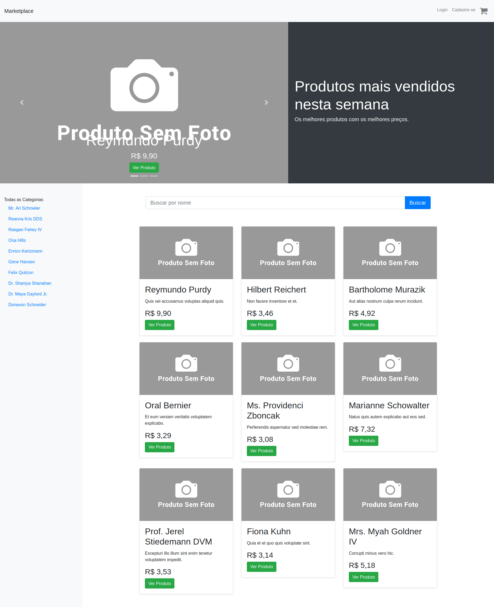

# Laravel Marketplace

## Descrição
Um sistema Web onde usuários podem vender ou comprar produtos.

## Tecnologia Usada
O projeto foi implementado usando o framework [Laravel](https://laravel.com/).

## Plugins Usados
Foi utilizado o [laravel-sluggable](https://github.com/spatie/laravel-sluggable) para geração de slugs.

